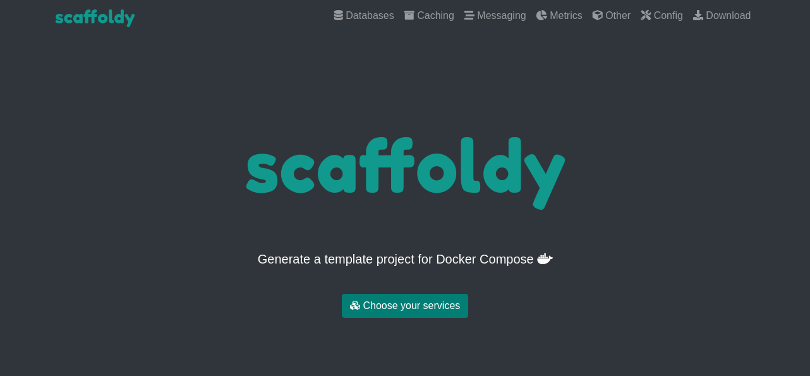

<h1 align=center>Scaffoldy</h1>

A web app for generating Docker Compose template projects

## Overview

Scaffoldy generates a project folder based on Docker compose.  
For the Compose File, it uses a blank, Python or Node.js alpine-based main app container and configurable templates 
for 13 services:
  * MySQL
  * MariaDB
  * PostgreSQL
  * MongoDB
  * Redis
  * Memcached
  * RabbitMQ
  * NATS
  * Prometheus
  * Grafana
  * Clickhouse
  * Elasticsearch
  * Mailhog
  
Scaffoldy can also include code examples based on the chosen language. 

## Requirements
* Docker and Docker Compose

## Setup

* Create a `.env` and a `.env.prod` file with the required env variables
* Run `start.sh` for development and `start.prod.sh` for production

  

